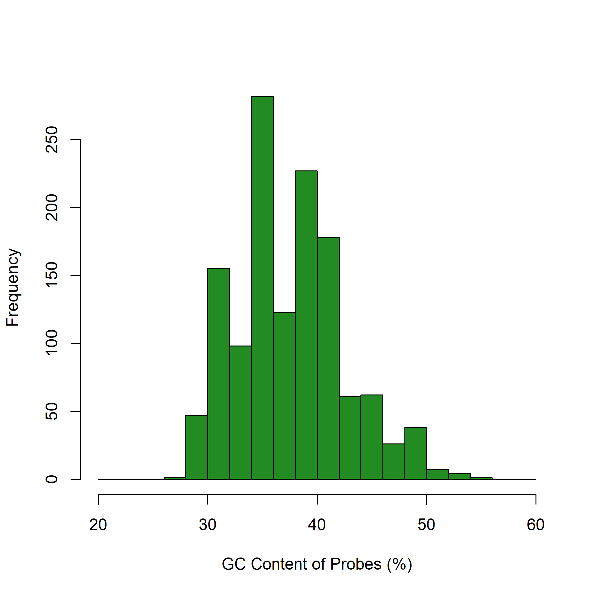
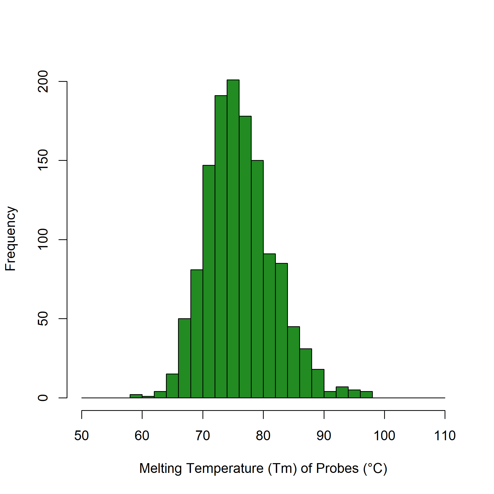
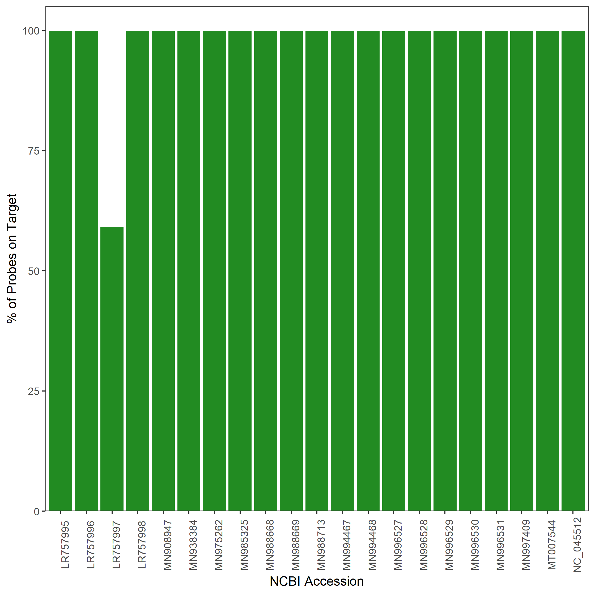
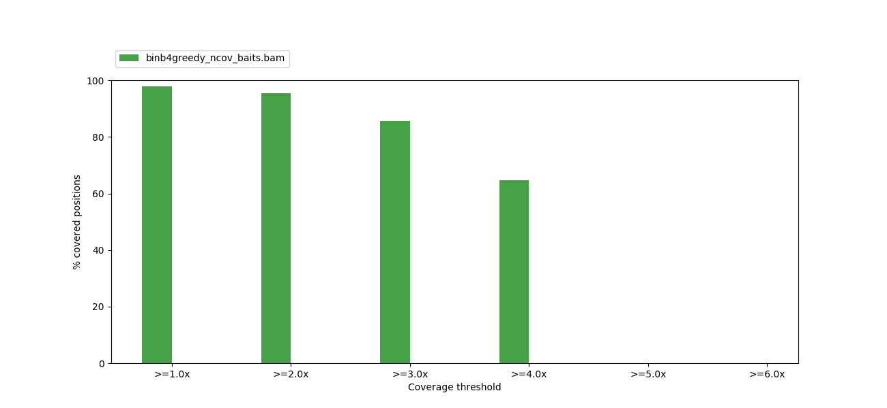
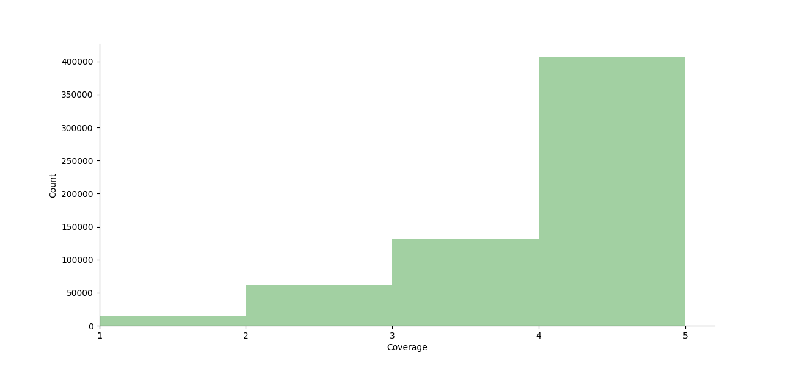
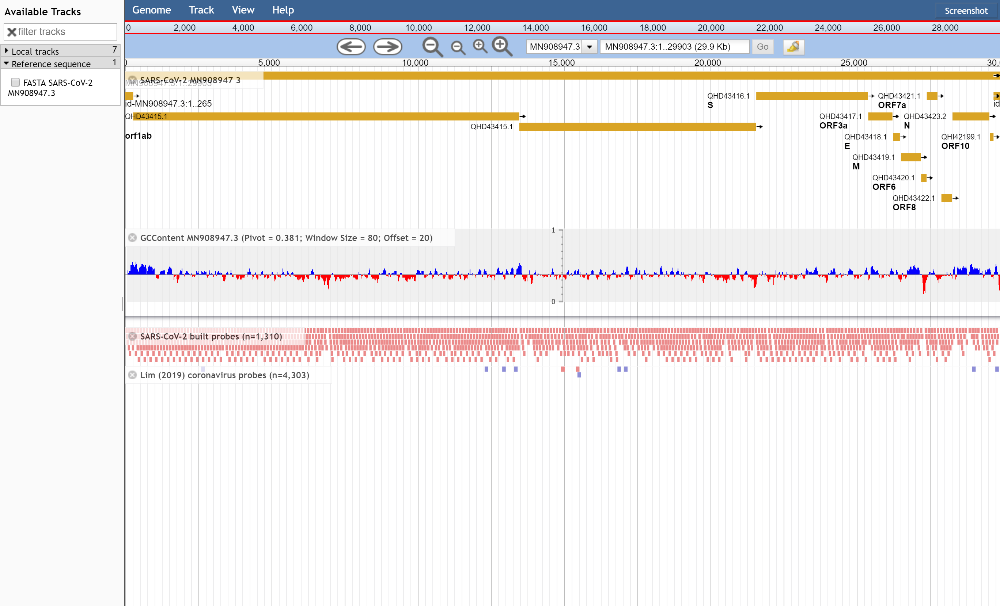
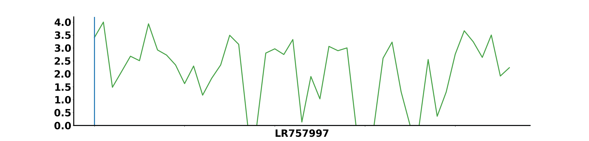
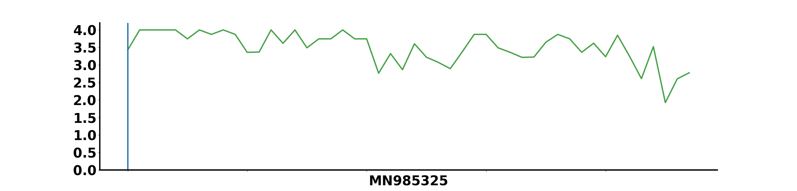
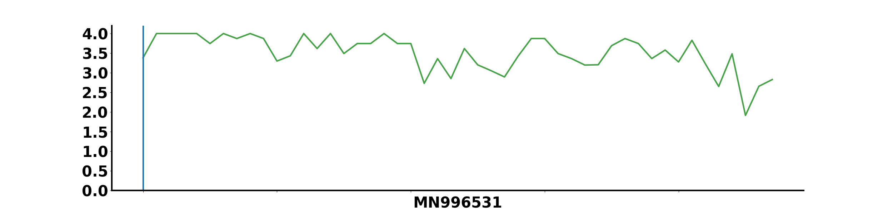

# Rapid design of a bait capture platform for culture- and amplification-free next-generation sequencing of SARS-CoV-2

SARS-CoV-2 is a novel betacoronavirus and the etiological agent of the current 2019 novel coronavirus outbreak that originated in Hubei Province, China. While polymerase chain reaction and cultural based methods are the front line tools for SARS-CoV-2 surveillance, application of amplification-free and culture-free methods for isolation of SARS-CoV-2 RNA, partnered with next generation sequencing, would provide a useful tool for both surveillance and research of SARS-CoV-2. We here release into the public domain a set of bait capture hybridization probe sequences for enrichment of SARS-CoV-2 RNA in complex biological samples. These probe sequences have been designed using rigorous bioinformatics methods to provide sensitivity, accuracy, and minimal off-target hybridization. Probe design was based on existing, validated approaches for detection of antimicrobial resistance genes in complex samples and it is our hope that this SARS-CoV-2 bait capture platform, once validated by those with samples in hand, will be of aid in combating the current outbreak.

Full description, methods, and results can be viewed here: PREPRINT.

# SARS-CoV-2 bait capture platform probe set

Download the [complete set of SARS-CoV-2 bait capture probes](./fasta_files/proposed_probe_set). The header of each sequence reflects the reference sequence / start co-ordinate / stop co-oridinate from which the probe was defined by the design pipeline, e.g. MN908947_1101-1180.

# Tools and Reference Sequences

* [Custom Python Scripts](./custom_scripts)
* [SARS-CoV-2 Reference Sequences](./fasta_files/references)
* [High Resolution Figures](./figures)
* [Supplementary Data: Probe Coverage of GISAID Genomes](./supplementary_data/GISAID_coverage)

# GC Content of Probes

# Melting Temperature of Probes

# Reads on Target

# Coverage plot of probes aligned to NCBI SARS-CoV-2 genomes

# Uniformity plot denoting depth of coverage of candidate probes across all possible nucleotide targets from NCBI SARS-CoV-2 genomes

# Alignment of candidate probes against a single SARS-CoV-2 genome (MN908947.3)
Top track: MN908947.3 GenBank annotation. Second track: MN908947.3 GC content between 0 and 100%. Third track: Alignment of candidate probes against MN908947.3. Bottom track: Alignment of CoV bait capture probes from Lim et al. 2019. Detection and characterization of a novel bat-borne coronavirus in Singapore using multiple molecular approaches. [Journal of General Virology 100:1363–1374](https://www.ncbi.nlm.nih.gov/pubmed/31418677) (designed prior to knowledge of SARS-CoV-2 genome sequence).

# Coverage plots of candidate probes across known SARS-CoV-2 complete genomes. The x-axis represents the base position on the genome denoted by the accession. The y-axis ranges from 0 to 4 fold coverage.

